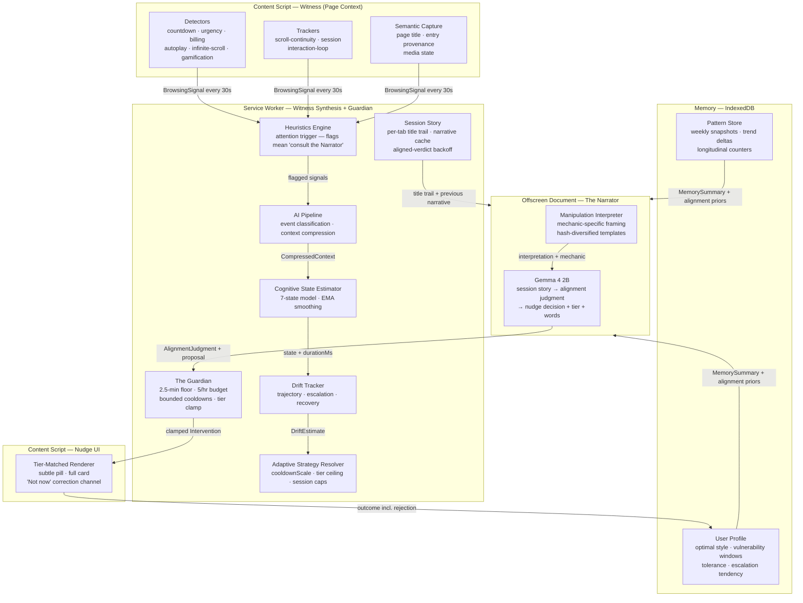
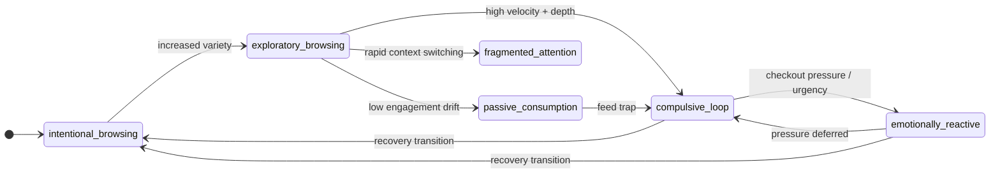

# Angel

> **Adaptive cognitive protection powered by on-device Gemma inference.**
> Angel reconstructs the story of each browsing session, judges whether it still serves the intent you arrived with, and offers reflective interventions only when the environment — not you — is steering. Everything runs on your device: page context, behavioural signals, session narratives, and intervention history never leave the browser. Model files are downloaded once and cached on-device.

---

## Overview

Modern digital environments are engineered to exploit cognitive vulnerabilities: countdown timers that manufacture urgency, infinite feeds that suppress disengagement, subscription funnels that escalate commitment through friction. Existing tools respond by blocking, restricting, or tracking screen time — approaches that treat the symptom by creating dependency on the tool rather than building the user's own capacity to navigate these environments.

Angel takes a different position. Rather than reducing exposure, Angel builds resilience. Rather than restricting access, Angel develops awareness. The goal is a user who needs the tool less over time, not more.

The question Angel answers is never "is this content bad?" — no topic, site, or format is inherently bad. A lecture, a PDF, a shopping page, or an evening of chosen entertainment can all be exactly what you meant to do. The question is **"is the user still the author of this session?"** Manipulation is a mismatch between what you came to do and what the environment got you doing — a property of the *trajectory*, not the content.

This is realized through a fully local three-layer pipeline — **Witness → Narrator → Guardian**: detectors and trackers collect testimony about the environment and your behavior; Gemma 4 2B, running in an isolated offscreen document, reconstructs the session story and judges intent alignment; and a small set of hard guardrails bounds how often anything may interrupt you. No data transmitted, no profile built on a server, no dependency on external APIs.

---

## Why Angel Exists

### The Manipulation Infrastructure Problem

The digital environments most people inhabit daily are built by optimization systems that maximize engagement, urgency, and commitment — often at direct expense to user autonomy. This is not incidental. Dark patterns are a documented design discipline:

- **Artificial urgency** — countdowns, "18 people viewing," "only 2 left" — manufactured scarcity that bypasses deliberate evaluation
- **Engagement loops** — infinite scroll, autoplay, variable reward intervals — behavioral conditioning borrowed from slot machine design
- **Commitment escalation** — trial-to-paid funnels, annual billing anchoring, loss-framed cancellation flows — gradual entrapment through sunk-cost mechanics
- **Attention fragmentation** — notification systems, news tickers, competing CTAs — deliberate cognitive overload that impairs decision quality

These mechanics are effective because they target specific cognitive states: emotional reactivity suppresses deliberation, compulsive loop states inhibit disengagement, decision fatigue makes commitment feel like relief.

### The Gap in Existing Responses

Current digital wellbeing tools operate on a protection model:

| Tool Category | Mechanism | Problem |
|---|---|---|
| Screen time limiters | Hard cutoffs | No behavior change — user waits out the clock |
| Content blockers | Allowlist/denylist | Brittle, bypassable, no pattern awareness |
| Focus apps | Restriction during work sessions | Orthogonal to manipulation detection |
| Browser extensions | Alert on known patterns | No cognitive modeling, no adaptive response |

Protection models create **dependency**, not resilience. When the tool is removed, the user is no better equipped than before. Angel is designed to produce the opposite outcome: a user who, after consistent engagement, has better pattern recognition, stronger intentionality, and reduced susceptibility — whether Angel is running or not.

---

## Core Philosophy

**Angel does not restrict. Angel reflects.**

Four principles govern every design decision:

1. **Resilience over restriction.** The measure of success is behavioral change that persists when the tool is absent, not compliance while it runs.

2. **Autonomy preservation.** Every intervention is offered, never imposed. Angel surfaces information; the user decides what to do with it.

3. **Non-judgmental framing.** Interventions describe what is happening in the environment — the mechanics of the manipulation — not what the user should feel or do. "This feed is designed to feel like it never ends" rather than "You've been scrolling for too long."

4. **Privacy as architecture.** The system is designed so that privacy is not a feature that can be removed — it is a consequence of the architecture. Inference runs locally; no behavioral data can be transmitted because the pipeline never produces anything transmittable. Because inference is local, the model can safely see rich context (page titles, session trajectory) that a cloud pipeline could never be trusted with.

5. **Innocent until proven captured.** The burden of proof always sits on intervention. An aligned session — chosen, coherent, deliberately paced — is structurally un-nudgeable, whatever its topic. Interrupting a user who chose to be where they are is treated as the worst failure available to the system.

---

## Key Features

- **Intent-alignment judgment (the Narrator)** — on-device Gemma reconstructs each session's story from entry provenance (searched? typed? pushed by a feed?), page-title trajectory, and behavioral testimony, then judges it `aligned`, `drifting`, or `captured`. An aligned verdict is a hard veto: no rule can nudge a user the model believes chose to be there
- **Real-time cognitive state estimation** — 7 distinct states (intentional, exploratory, passive consumption, compulsive loop, emotionally reactive, fragmented attention, decision fatigue) estimated from behavioral signals and fed to the Narrator as evidence; page text is scanned locally to detect patterns but is never stored or transmitted
- **On-device Gemma 4 2B inference** — runs on WebGPU (preferred) or WASM fallback; no API keys, no server, no inference calls leaving the device
- **Manipulation Interpretation Layer** — mechanic-specific framing templates (urgency amplification, engagement loops, emotional escalation, attention capture, variable reward, social momentum, decision pressure) that name what is happening rather than moralizing about it
- **The Guardian** — a small set of hard, auditable delivery limits: an absolute 2.5-minute floor between nudges, a 5-per-hour budget, and bounded adaptive cooldowns. The AI proposes; the Guardian can only say "not yet" or "smaller"
- **Angel Presence** — a 0–1 slider that biases the adaptive system: quiet end extends cooldowns, raises confidence thresholds, and lowers session caps; active end does the inverse. The default (0.45) is a conservative adaptive midpoint; the underlying cognitive modeling is unchanged regardless of setting
- **A correction channel that learns** — every full card carries "Not now — I chose to be here." One tap overrides the judgment, opts that state out for the session, and feeds the strongest possible label back into Angel's per-category alignment priors
- **Longitudinal resilience modeling** — weekly pattern snapshots, EMA-based profile evolution, tolerance/recovery tracking, and category-level alignment priors that adapt to individual behavioral rhythms
- **Evaluation framework** — measures awareness quality (post-nudge recovery rate, reflective engagement depth, recovery acceleration) rather than screen time
- **Tiered delivery** — subtle pill overlays for loops and drift; full card interventions reserved for high-stakes decision pressure
- **Zero telemetry** — all storage is IndexedDB + chrome.storage.local; the only network request is the one-time model download

---

## System Architecture

Angel is three layers with strictly separated authority — **the Witness collects, the Narrator judges, the Guardian bounds**:

| Layer | Role | Authority |
|---|---|---|
| **Witness** | Detectors, trackers, heuristics, cognitive state estimator, drift tracker | Collects testimony. Never decides anything — a heuristic flag means "worth the Narrator's attention", never "intervene" |
| **Narrator** | Gemma 4 2B in the offscreen document | Reconstructs the session story, judges intent alignment, and decides *whether*, *at what tier*, and *with what words* to nudge |
| **Guardian** | Hard delivery limits in the service worker | Enforces ceilings only — spacing floor, hourly budget, tier clamp. Can say "not yet" or "smaller", never "yes" |



### Why Each Layer Exists

| Layer | Rationale |
|---|---|
| **Detectors** | DOM-pattern recognition is fast, deterministic, and privacy-safe. Page text is scanned locally by regex to detect known manipulation patterns — text is never stored or transmitted. Structural signals (timer decrement, feed height growth) supplement the text matching. |
| **Trackers** | Behavioral continuity metrics (scroll velocity, session duration, interaction rate) that detectors cannot see — the difference between visiting a checkout page and being trapped in one. |
| **Semantic Capture** | Page title, entry provenance (search/typed/feed-push), and media state — the evidence that distinguishes a lecture from a doomscroll. Held in memory per tab for the local prompt; never persisted, never transmitted. |
| **Heuristics Engine** | Aggregates detector + tracker outputs into a `BrowsingSignal` and decides whether the moment is *worth the Narrator's attention*. A flag is an attention trigger, never a verdict — keeps inference from running on every scroll event. |
| **AI Pipeline** | Classifies the event type, compresses session context into a compact evidence block. This is the synthesis step — raw signals become testimony the Narrator can read. |
| **Cognitive State Estimator** | Maps the compressed context onto the 7-state model using signal weights + EMA smoothing. Runs synchronously — no I/O, deterministic. Its estimate is evidence for the Narrator, not a decision. |
| **Drift Tracker** | Looks at the state history window to detect trajectories: `stable`, `escalating`, `rapid_escalation`, `recovering`, `volatile`. A `recovering` trajectory suppresses interventions outright. |
| **Session Story** | Per-tab rolling narrative: title trail, entry type, the Narrator's last judgment. A confident `aligned` verdict buys an 8-minute quiet period; one consultation per tab at a time. |
| **Adaptive Strategy Resolver** | Per-state strategy matrix with dynamic overrides plus Angel Presence bias. Supplies minimum confidence, tier ceiling, cooldown scaling, entry delay, and session cap to the Guardian. |
| **The Guardian** | Hard delivery limits: 2.5-minute absolute floor, 5-nudge hourly budget, adaptive cooldowns clamped to [0.5×, 6×], full-card confidence bar. The Narrator proposes; the Guardian only clamps. |
| **Manipulation Interpreter** | Maps detected mechanics to framing templates. Uses a day-indexed hash (not hour/random) to cycle template slots daily — variety without per-session repetition. |
| **Gemma (the Narrator)** | Reconstructs the session story, judges alignment (`aligned` / `drifting` / `captured`), and — only for misaligned sessions — proposes a nudge with tier and wording grounded in that story. |
| **Nudge UI** | Tier-matched rendering (pill vs. full card). Distinguishes four outcomes: accepted, dismissed, ignored (auto-timeout — never counted as engagement), and rejected ("Not now" — the correction channel). |

---

## Cognitive State Modeling

Angel models user cognitive state across 7 discrete categories estimated from behavioral signals — no self-reporting, no stored or transmitted content. The estimate is *witness testimony*: a fast, deterministic prior that the Narrator weighs alongside the session's semantic trajectory. It informs judgment; it never triggers a nudge by itself.



| State | Description | Primary Signals |
|---|---|---|
| `intentional_browsing` | Goal-directed, deliberate | Low dwell variance, bounded scroll, purposeful tab switching |
| `exploratory_browsing` | Open-ended but not compulsive | Moderate scroll, multiple domains, no doom-scroll velocity |
| `passive_consumption` | Drifting, low-engagement session | Extended session without depth, low interaction rate, ambient scrolling |
| `compulsive_loop` | Repetitive, hard-to-disengage pattern | High scroll velocity, single-domain, long session, feed growth |
| `emotionally_reactive` | Decision-making under manufactured pressure | Countdown timers, urgency language, checkout signals, social proof |
| `fragmented_attention` | Competing contexts, rapid switching | Tab count, switching velocity, incomplete task patterns |
| `decision_fatigue` | Commitment architecture exploitation | Subscription funnel signals, trial language, annual billing anchoring |

The **Drift Tracker** maintains a rolling window of recent cognitive states to compute a trajectory (`stable` / `escalating` / `rapid_escalation` / `recovering` / `volatile`). A `recovering` trajectory suppresses interventions; `rapid_escalation` lowers confidence thresholds. The tracker prevents the system from firing when the user is already correcting course.

Over time, the **User Profile** builds an EMA-derived model of: optimal intervention tone, vulnerability hours, escalation tendency, tolerance level, and recovery duration. This profile is private to the device and informs both gate decisions and Gemma's context.

---

## Manipulation Detection Pipeline

### Structural Detectors

| Detector | Mechanism | Patterns Detected |
|---|---|---|
| `countdown` | Monitors text nodes matching `H:MM:SS` / `MM:SS`; confirms decreasing value over 2 samples | `countdown_timer` (confirmed decreasing) |
| `urgency` | Regex against 7 urgency language categories across all text nodes | `urgency_language` (limited_time, act_now, ends_tonight, last_chance, hurry, offer_expires, dont_miss_out) |
| `infinite-scroll` | Feed container height growth near scroll bottom; `data-infinite` structural fallback | `infinite_feed` |
| `autoplay` | `<video autoplay>` detection; intersection observer for viewport visibility | `autoplay_media` |
| `billing` | Text pattern matching for trial language, recurring billing, annual/monthly commitment framing | `trial_language`, `recurring_billing` |
| `gamification` | Spin/prize/claim language scan + structural check for canvas/SVG inside overlays | `gamification` |

### Behavioral Trackers

| Tracker | Measurement | Derived Signal |
|---|---|---|
| `scroll-continuity` | Scroll velocity (px/s) via EMA; gap timing | `doom_scrolling` flag (≥2500 px/s sustained) |
| `session` | Time since first interaction via RAF timestamp | `minutes_active`, `long_session` flag |
| `interaction-loop` | Click + keypress + scroll rate over sliding window | `rapid_interaction` velocity |

Flagging requires both a detector signal AND a behavioral amplifier — a page with a countdown timer that the user glanced at for 10 seconds is not the same as a user who has been on a checkout page for 8 minutes under a live countdown.

---

## Adaptive Intervention Pipeline

### Session Evidence Encoding

Rather than sending raw signals to Gemma, Angel synthesizes the session into three compact evidence lines — semantic context, witness testimony, and continuity:

```
page:"10 CRAZY facts you won't believe" trail:"Eigenvalues explained" > "Math tricks" entry:search media
witness: state:compulsive_loop event:engagement_hook traj:rapid_escalation depth:0.8 74m doom
story:"Began with math lectures from search; autoplay drifting into clickbait." | prior:mixed | hist:doom_scroll_episodes weeks:4 acc:38% | tone:reflective | skip:"There's always more here"
```

The first line is what makes intent legible: the title trail shows *where the session has drifted*, and the entry type shows *who started it* — the user (search, typed) or the environment (feed push). Titles and narratives exist only in this prompt and the per-tab in-memory story; they are never persisted and never leave the device.

From this evidence the model produces a full judgment, not just text:

```json
{ "alignment": "captured", "confidence": 0.75,
  "narrative": "Began with math lectures from search; autoplay has drifted the last half hour into clickbait.",
  "intent": "studying linear algebra",
  "decision_state": "intervene", "tier_hint": "subtle",
  "intervention_message": "This started with eigenvalues — the feed has chosen the last few videos." }
```

An `aligned` verdict is a hard veto enforced in code — whatever the decision field says, an aligned user is never nudged. The narrative is cached per tab and fed back as the `story:` line next time, so judgments build on each other across the session.

### Manipulation Interpretation Layer

Before inference, the Manipulation Interpreter generates a mechanic-specific framing observation:

```typescript
type ManipulationMechanic =
  | 'urgency_amplification'    // countdown timers, artificial deadlines
  | 'engagement_loop'          // infinite feed, autoplay chains
  | 'emotional_escalation'     // subscription funnels, commitment pressure
  | 'attention_capture'        // competing contexts, notification pressure
  | 'variable_reward'          // intermittent reinforcement, feed variability
  | 'social_momentum'          // "18 people viewing," trending signals
  | 'decision_pressure'        // checkout urgency, time-limited offers
```

Each mechanic has 5 framing templates. Template selection uses a day-indexed hash — variety across days without per-session state.

### The Narrator's Contract

The system prompt frames the model as a narrator with a three-step method — story, alignment, decision — and explicit rules of evidence: *content is never the verdict; entry matters; media on a stable topic is engagement, not idleness; the burden of proof is on 'captured'.* Worked examples cover the three cases that matter most: an aligned study session (skip), an autoplay drift away from the entry intent (subtle nudge grounded in the story), and checkout pressure (full card). The model is not instructed to push harder when a user is struggling — it is instructed to step back.

### Adaptive Strategy

```typescript
interface InterventionStrategy {
  minConfidence:       number          // gate threshold override
  preferredTier:       InterventionTier  // 'full' | 'subtle' | 'none'
  cooldownScale:       number          // multiplied into base cooldowns
  stateEntryDelayMs:   number          // wait after state transition before first fire
  sessionDismissalCap: number          // max interventions per state per session
}
```

Five dynamic overrides: recovering trajectory sets `preferredTier: 'none'` (never interrupt a correction already in progress); state entry delay enforces a stabilization window before the first nudge; session dismissal cap reached disables further firing for that state — and an explicit "Not now" rejection trips it instantly; persistence > 30 min in a stable compulsive/reactive state backs off (user has settled); rapid escalation shortens cooldowns to bring the intervention forward. Separately, state acceptance rate < 20% (from profile) extends cooldowns by 1.5×. All resulting scale factors are inputs to the Guardian, which clamps their product to [0.5×, 6×] and enforces the absolute floor and hourly budget on top.

The **Angel Presence** slider (0.0–1.0) feeds into `resolveStrategy()` as a final bias layer: it scales cooldowns, shifts confidence thresholds, and adjusts entry delays and session caps — without touching the cognitive model or gate logic. Zone boundaries: quiet (≤ 0.33), adaptive (0.33–0.66, default 0.45), active (≥ 0.67).

---

## Longitudinal Resilience Modeling

### Pattern Storage

All behavioral patterns are stored as simple counters in IndexedDB — no timestamps, no URLs, no content references:

```typescript
type PatternKey =
  | 'doom_scroll_episodes'         | 'checkout_pressure_events'
  | 'engagement_hook_events'       | 'subscription_funnel_events'
  | 'rapid_tab_switching_episodes' | 'long_passive_sessions'
  | 'late_night_scroll_sessions'
  | 'interventions_shown'          | 'interventions_accepted'
  | 'interventions_quick_dismissed'
  | 'compulsive_loop_entries'      | 'reactive_entries'
  | 'recovery_transitions'         | 'post_nudge_recoveries'
  | 'reflective_engagements'
```

Weekly snapshots of cumulative counts enable delta-based trend analysis without event-level storage.

Alongside the counters, Angel keeps **alignment priors**: per-category tallies of the Narrator's verdicts (`aligned` / `drifting` / `captured`), keyed by coarse domain category (`streaming`, `social`, `ecommerce`, …) — never by domain or URL. A "Not now" rejection writes a corrective `aligned` tally, so the system learns where its judgment tends to be wrong. Priors decay over time and are summarized into a single token (`usually_aligned` / `mixed` / `often_captured`) in the Narrator's prompt.

### Memory Summary

The context injected into Gemma contains only:

```typescript
interface MemorySummary {
  dominant_pattern:   PatternKey | null   // highest-count behavioral pattern
  acceptance_rate:    number              // fraction of nudges that led to engagement
  weeks_active:       number              // longitudinal depth
  optimal_style:      InterventionStyle   // EMA-derived best tone
  vulnerable_now:     boolean             // current hour matches vulnerability window
  tolerance_level:    number              // EMA of recent responsiveness
  escalates_fast:     boolean             // quick compulsive state transitions
  recovery_minutes:   number              // EMA of recovery duration
}
```

This gives Gemma enough context to adapt tone and framing without any identifying information — no URLs, no raw page content, no timestamps.

---

## Evaluation Framework

Angel measures the quality of behavioral change, not quantity of screen time avoided.

| Metric | Definition | Why It Matters |
|---|---|---|
| **Post-nudge recovery rate** | Fraction of compulsive-state interventions followed by a recovery transition within 15 minutes | Measures whether interventions interrupt compulsive patterns, not just whether they were acknowledged |
| **Reflective engagement rate** | Fraction of accepted interventions where dwell ≥ 8 seconds | Distinguishes genuine reflection from dismissal-by-acceptance |
| **Recovery acceleration** | EMA of time from compulsive state onset to natural recovery | Decreasing duration over weeks indicates growing self-regulation capacity |
| **Escalation depth** | Time from session start to first compulsive state entry (EMA) | Increasing depth = user sustaining intentional browsing longer before slipping |
| **Awareness building** | Escalation depth > 10 min AND trending upward over 2+ weeks | Indicates the user is catching themselves earlier and earlier in the loop |

Each metric produces a weekly trend direction: `improving` / `stable` / `needs_attention` / `insufficient_data` (≥20% change threshold). Trend indicators appear in the popup — not scores, not streaks, not gamification.

**What Angel does not measure:** total screen time, "productive" sessions, app category usage. A high acceptance rate with no behavior change is failure. A low acceptance rate with strong recovery transitions is success. See [docs/EVALUATION.md](docs/EVALUATION.md) for the full measurement philosophy.

---

## Privacy & Local Inference

Privacy in Angel is not a setting — it is an architectural consequence.

| Property | Implementation |
|---|---|
| **No data transmission** | The only network request after install is the one-time model download from Hugging Face CDN |
| **No content stored or transmitted** | Detectors scan page text and DOM structure locally — nothing is stored or sent off-device. Trackers record only metrics (velocity, time), never content |
| **Semantic context is ephemeral** | Page titles and session narratives exist only in per-tab memory and the local inference prompt. They are never written to storage, never transmitted, and vanish when the tab closes or the service worker restarts. Local inference is what makes this safe: the model can see rich context precisely because nothing it sees can leave the device |
| **Aggregated counters only** | IndexedDB stores pattern counts (integers) and behavioral profiles (floats); alignment priors are tallied per coarse domain *category*, never per domain or URL. No event log, no session history, no page-level data |
| **Isolated inference** | Gemma runs in a Chrome offscreen document with no DOM access. The inference context is synthesized evidence, never raw page HTML |
| **Local profile only** | User profile exists only in the user's browser — no account, no sync, no cloud backup |
| **Open source** | The entire pipeline is auditable. No obfuscated code, no binary-only components beyond Gemma weights |

---

## Gemma Integration

### Model

`onnx-community/gemma-4-E2B-it-ONNX` — Gemma 4 2B instruction-tuned, quantized for browser deployment:

- **WebGPU**: q4f16 quantization (~3.9 GB) — GPU-accelerated, ~2–4s latency per nudge
- **WASM fallback**: q4 quantization (~2 GB) — CPU inference, ~8–15s latency

### What Gemma Decides vs. What Is Heuristic

| Component | Gemma (Narrator) | Heuristic |
|---|---|---|
| Detector pattern matching | — | ✓ (DOM regex + structural) |
| Event type classification | — | ✓ (pipeline/classify.ts) |
| Cognitive state estimation | — | ✓ (signal weights + EMA — fed to Gemma as evidence) |
| Drift trajectory | — | ✓ (history window analysis — fed to Gemma as evidence) |
| **Session story + intent inference** | ✓ | — |
| **Alignment judgment (aligned / drifting / captured)** | ✓ | — |
| **Whether to nudge** | ✓ (aligned = hard veto) | Guardian may only veto or delay |
| **Tier proposal (subtle / full)** | ✓ | Guardian clamps (floor, budget, confidence bar) |
| Intervention text generation | ✓ (grounded in the session story) | template fallback for the observation line |
| Framing tone adaptation | ✓ | ✓ (intensity resolver pre-selects) |
| Action label selection | — | ✓ (action-resolver.ts — resolveAction()) |
| Delivery limits | — | ✓ (the Guardian — floor, budget, clamped cooldowns) |

Gemma is used where it adds irreplaceable value: understanding what a session *is* — the one question no rule stack can answer — and speaking about it in language that is contextually appropriate, non-judgmental, and varied. The heuristics collect evidence and enforce ceilings; they no longer decide.

### Inference Design

- `MAX_NEW_TOKENS = 200` — judgment JSON (narrative + decision + message) runs ~110–140 tokens
- Similarity check (unigram Jaccard ≥ 0.50 + bigram Jaccard ≥ 0.40) prevents recent phrase repetition
- Evidence pre-encoding keeps the user turn compact vs. raw signal passing; secondary schema fields degrade to defaults rather than burning retries
- Narrator cadence: one consultation per tab at a time (requestId-routed, no cross-tab races), ≥90 s between consultations, and a confident `aligned` verdict suppresses re-judging for 8 minutes
- Offscreen document pre-warmed on extension install — not lazily loaded on first signal
- `model-keepalive` Chrome runtime port prevents service worker termination during download

---

## Technical Stack

| Component | Technology |
|---|---|
| Extension framework | Chrome MV3, `@crxjs/vite-plugin` |
| Build | Vite 5 |
| UI | React 18, Tailwind CSS, Framer Motion |
| Type system | TypeScript strict mode, discriminated unions |
| Model runtime | `@huggingface/transformers` 4.2+, ONNX Runtime Web |
| Storage | IndexedDB (direct API), `chrome.storage.local`, `chrome.storage.session` |

---

## Repository Structure

```
angel/
├── src/
│   ├── ai/                   # Inference engine, prompts, interpretation
│   │   ├── engine.ts         # Gemma model load, device selection, caching
│   │   ├── infer.ts          # Inference execution, similarity check
│   │   ├── index.ts          # judgeSession() — alignment judgment + nudge proposal
│   │   ├── interpretation.ts # Manipulation Interpreter
│   │   ├── prompts.ts        # encodeEvidence() — semantic/witness/continuity lines
│   │   ├── system-prompt.ts  # The Narrator's contract with worked examples
│   │   ├── guidance.ts       # resolveIntensity(), isTooSimilar()
│   │   ├── cache.ts          # Phrase ring buffer
│   │   ├── schema.ts         # Zod schemas for inference I/O
│   │   └── pipeline/         # Signal → EventType → CompressedContext
│   │
│   ├── background/           # Service worker — witness synthesis + Guardian
│   │   ├── index.ts          # Main dispatch, requestId-routed orchestration
│   │   ├── narrator.ts       # Per-tab session story, judgment cache, consult cadence
│   │   ├── priors.ts         # Per-category alignment priors (learned, decaying)
│   │   ├── cognitive-state.ts # 7-state estimator, EMA, transition detection
│   │   ├── drift.ts          # Trajectory analysis, HEALTH_SCORE table
│   │   ├── gate.ts           # The Guardian — floor, budget, bounded cooldowns, tier clamp
│   │   ├── intervention-strategy.ts  # STATE_STRATEGY table, resolveStrategy()
│   │   ├── action-resolver.ts # resolveAction() — deterministic action label from state × mechanic
│   │   ├── presence.ts       # derivePresence() — presence level → PresenceProfile bias
│   │   └── phrase-cache.ts   # Recent phrase ring buffer
│   │
│   ├── content/              # Page observation
│   │   ├── index.ts          # Initialization, 30s signal dispatch loop
│   │   ├── ui.tsx            # Nudge rendering, dwell timing, outcome reporting
│   │   ├── detectors/        # 6 structural pattern detectors
│   │   └── trackers/         # 3 behavioral metric trackers
│   │
│   ├── memory/               # IndexedDB — longitudinal modeling
│   │   ├── index.ts          # Pattern counters, snapshots, memory summary
│   │   ├── db.ts             # IDB schema and CRUD helpers
│   │   ├── profile.ts        # User profile building, EMA updates
│   │   └── evaluation.ts     # Evaluation metrics derivation
│   │
│   ├── heuristics/index.ts   # evaluate() — aggregate flagging decision
│   ├── offscreen/            # Isolated Gemma inference document
│   ├── popup/                # React popup UI
│   ├── shared/               # Types, message contracts, constants
│   ├── storage/              # chrome.storage.local wrapper
│   └── ui/components/        # Shared React components (Nudge)
│
├── demo/                     # 5 reproducible test scenarios
│   ├── index.html            # Scenario index
│   ├── checkout.html         # emotionally_reactive / decision_pressure
│   ├── feed.html             # compulsive_loop / engagement_loop
│   ├── news.html             # fragmented_attention / attention_capture
│   ├── subscription.html     # decision_fatigue / emotional_escalation
│   └── tabs.html             # fragmented_attention / attention_capture
│
├── docs/
│   ├── ARCHITECTURE.md       # Layer-by-layer technical deep-dive
│   ├── COGNITIVE_MODEL.md    # State machine, drift, profile building
│   └── EVALUATION.md         # Metrics framework and measurement philosophy
│
└── public/                   # ORT runtime files (WASM binary gitignored)
```

---

## Documentation

| Document | Description |
|---|---|
| [docs/ARCHITECTURE.md](docs/ARCHITECTURE.md) | Layer-by-layer technical deep-dive: the Witness → Narrator → Guardian pipeline, data flow, performance characteristics, and extension lifecycle |
| [docs/COGNITIVE_MODEL.md](docs/COGNITIVE_MODEL.md) | Intent alignment, the 7-state cognitive model as witness evidence, drift tracking, HEALTH_SCORE table, user profile structure, and weekly snapshot design |
| [docs/EVALUATION.md](docs/EVALUATION.md) | Measurement philosophy, all five core metrics (post-nudge recovery, reflective engagement, escalation depth, awareness building), and what Angel explicitly does not measure |
| [CONTRIBUTING.md](CONTRIBUTING.md) | Setup instructions, high-value contribution areas (detectors, templates, cognitive model, strategy, evaluation), code conventions, and privacy invariants |

---

## Installation

### User install (release ZIP)

1. Download `angel-extension.zip` from the [latest release](https://github.com/shaw029/angel/releases/latest)
2. Unzip it anywhere on your machine
3. Open `chrome://extensions` in Chrome
4. Enable **Developer mode** (toggle, top right)
5. Click **Load unpacked** and select the unzipped folder

The model downloads in the background on first install (~3.9 GB GPU / ~2 GB WASM). Progress is visible in the popup.

### Developer install (build from source)

**Requirements:** Node 18+, Chrome 116+, Python 3 (demo server), POSIX shell (macOS/Linux/Git Bash — `npm run setup` uses `cp`), ~4 GB free disk space

```bash
npm install
npm run setup      # copies ORT WASM binary from node_modules (~23 MB) — requires POSIX cp
npm run build      # bundles extension into dist/
```

Load in Chrome: `chrome://extensions` → **Developer mode** → **Load unpacked** → select `dist/`

```bash
npm run dev        # watch mode — rebuilds on every save
npm run start      # watch + demo server at localhost:3001 — requires python3
npm run typecheck  # TypeScript check without build
npm run demo       # demo pages only — requires python3
```

**Landing page** (`landing/`) is a separate Vite app — run `cd landing && npm install && npm run build` to build it independently of the extension.

### Demo Scenarios

```bash
npm run demo
# Open http://localhost:3001
```

Each demo page contains authentic dark-pattern DOM structure that the extension's detectors actively scan. There are two ways to see a nudge:

**Natural detection (exercises the full pipeline):** Browse the page normally for ~30–60 seconds. The heuristics engine, cognitive state estimator, and Gemma inference all run as normal. The tier and tone will reflect the actual detected state.

**"Activate Now" button (UI preview only):** Each demo page has an "Activate Now" button that dispatches a `ca:demo-trigger` event. This bypasses inference and the gate entirely and always shows the same hardcoded full-card nudge (`tone: gentle`, `message: "You can take a moment before deciding."`). It is useful for testing the nudge UI and dismiss flow, but does **not** exercise the cognitive model, detector pipeline, or tier selection.

The table below describes what the real pipeline targets on each page — these states and tiers will appear through natural detection, not through the button:

| Scenario | Targeted state | Mechanic | Expected tier |
|---|---|---|---|
| Artificial Urgency Checkout | `emotionally_reactive` | `decision_pressure` | full card |
| Infinite Scroll Feed | `compulsive_loop` | `engagement_loop` | subtle pill |
| Attention Overload News | `fragmented_attention` | `attention_capture` | subtle pill |
| Subscription Commitment Funnel | `decision_fatigue` | `emotional_escalation` | full card |
| Distracted Browsing | `fragmented_attention` | `attention_capture` | subtle pill |

---

## Future Directions

- **Gemma fine-tuning** on curated reflective interventions, evaluated by `reflective_engagement_rate` signal — shorter, better-calibrated responses without the full 120-token budget
- **Richer state modeling** — emotional valence from interaction patterns (not content), cross-session state continuity, social context signals
- **Community mechanics corpus** — structured contribution pathway for expanding manipulation mechanic templates without touching inference code
- **Federated resilience research** — aggregate (never individual) opt-in trend data to inform a public dark patterns dataset

---

## Research Grounding

Angel draws on several bodies of work:

- **Dark patterns** — Gray et al. (2018), Mathur et al. (2019) *"Dark Patterns at Scale"* — taxonomy of manipulation mechanics that informed the detector and interpreter design
- **Self-determination theory** — Deci & Ryan (2000) — the autonomy-supportive vs. controlling intervention distinction; Angel's interventions are explicitly autonomy-preserving
- **Cognitive load and decision quality** — Kahneman (2011) *Thinking, Fast and Slow* — System 1 exploitation by urgency mechanics; System 2 restoration as the intervention goal
- **Metacognitive awareness** — the non-judgmental, observational framing is grounded in mindfulness-based metacognition research; naming the mechanic without moralizing supports awareness without shame
- **Self-control tools failure modes** — Lyngs et al. (2019) *"Self-Control in Cyberspace"* — the failure modes of restrictive tools and the case for awareness-based alternatives that motivated Angel's resilience-over-restriction position

---

## License

MIT

---

<div align="center">
  <sub>Runs entirely on your device · No browsing data leaves your browser · Model files downloaded once · Built with Gemma 4 2B</sub>
</div>
