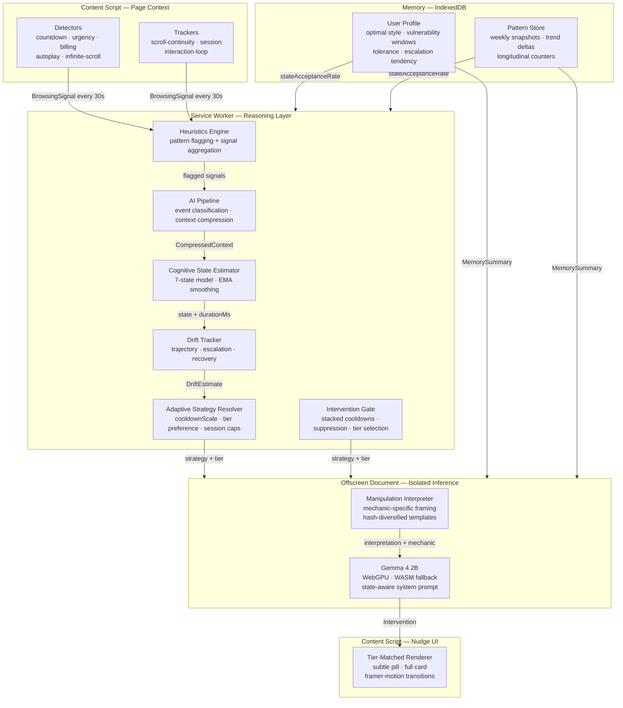
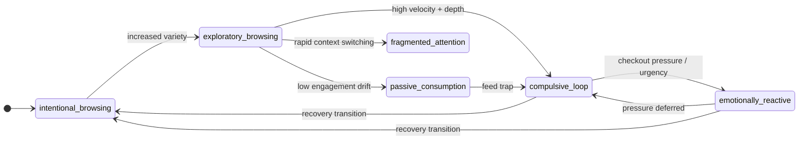

# Angel

> **Adaptive cognitive protection powered by on-device Gemma inference.**
> Angel detects manipulative digital environments, models cognitive state in real time, and delivers reflective interventions that build lasting resilience — entirely on your device, with no data leaving the browser.

---

## Overview

Modern digital environments are engineered to exploit cognitive vulnerabilities: countdown timers that manufacture urgency, infinite feeds that suppress disengagement, subscription funnels that escalate commitment through friction. Existing tools respond by blocking, restricting, or tracking screen time — approaches that treat the symptom by creating dependency on the tool rather than building the user's own capacity to navigate these environments.

Angel takes a different position. Rather than reducing exposure, Angel builds resilience. Rather than restricting access, Angel develops awareness. The goal is a user who needs the tool less over time, not more.

This is realized through a fully local inference pipeline: a content script that monitors behavioral patterns, a cognitive state estimator running in the service worker, and Gemma 4 2B generating personalized reflective interventions in an isolated offscreen document — no data transmitted, no profile built on a server, no dependency on external APIs.

---

## Why Angel Exists

### The Manipulation Infrastructure Problem

The digital environments most people inhabit daily are built by optimization systems that maximize engagement, urgency, and commitment — often at direct expense to user autonomy. This is not incidental. Dark patterns are a documented design discipline:

- **Artificial urgency** — countdowns, "18 people viewing," "only 2 left" — manufactured scarcity that bypasses deliberate evaluation
- **Engagement loops** — infinite scroll, autoplay, variable reward intervals — behavioral conditioning borrowed from slot machine design
- **Commitment escalation** — trial-to-paid funnels, annual billing anchoring, loss-framed cancellation flows — gradual entrapment through sunk-cost mechanics
- **Attention fragmentation** — notification systems, news tickers, competing CTAs — deliberate cognitive overload that impairs decision quality

These mechanics are effective because they target specific cognitive states: emotional reactivity suppresses deliberation, compulsive loop states inhibit disengagement, decision fatigue makes commitment feel like relief.

### The Gap in Existing Responses

Current digital wellbeing tools operate on a protection model:

| Tool Category | Mechanism | Problem |
|---|---|---|
| Screen time limiters | Hard cutoffs | No behavior change — user waits out the clock |
| Content blockers | Allowlist/denylist | Brittle, bypassable, no pattern awareness |
| Focus apps | Restriction during work sessions | Orthogonal to manipulation detection |
| Browser extensions | Alert on known patterns | No cognitive modeling, no adaptive response |

Protection models create **dependency**, not resilience. When the tool is removed, the user is no better equipped than before. Angel is designed to produce the opposite outcome: a user who, after consistent engagement, has better pattern recognition, stronger intentionality, and reduced susceptibility — whether Angel is running or not.

---

## Core Philosophy

**Angel does not restrict. Angel reflects.**

Four principles govern every design decision:

1. **Resilience over restriction.** The measure of success is behavioral change that persists when the tool is absent, not compliance while it runs.

2. **Autonomy preservation.** Every intervention is offered, never imposed. Angel surfaces information; the user decides what to do with it.

3. **Non-judgmental framing.** Interventions describe what is happening in the environment — the mechanics of the manipulation — not what the user should feel or do. "This feed is designed to feel like it never ends" rather than "You've been scrolling for too long."

4. **Privacy as architecture.** The system is designed so that privacy is not a feature that can be removed — it is a consequence of the architecture. Inference runs locally; no behavioral data can be transmitted because the pipeline never produces anything transmittable.

---

## Key Features

- **Real-time cognitive state estimation** — 7 distinct states (intentional, exploratory, passive consumption, compulsive loop, emotionally reactive, fragmented attention, decision fatigue) estimated from behavioral signals without any page content analysis
- **On-device Gemma 4 2B inference** — runs on WebGPU (preferred) or WASM fallback; no API keys, no server, no inference calls leaving the device
- **Manipulation Interpretation Layer** — mechanic-specific framing templates (urgency amplification, engagement loops, emotional escalation, attention capture, variable reward, social momentum, decision pressure) that name what is happening rather than moralizing about it
- **Adaptive intervention strategy** — per-state strategy matrix with dynamic overrides for drift trajectory, session persistence, and user responsiveness history
- **Angel Presence** — a 0–1 slider that biases the adaptive system: quiet end extends cooldowns, raises confidence thresholds, and lowers session caps; active end does the inverse. The default (0.45) is a conservative adaptive midpoint; the underlying cognitive modeling is unchanged regardless of setting
- **Longitudinal resilience modeling** — weekly pattern snapshots, EMA-based profile evolution, tolerance/recovery tracking that adapts to individual behavioral rhythms
- **Evaluation framework** — measures awareness quality (post-nudge recovery rate, reflective engagement depth, recovery acceleration) rather than screen time
- **Tiered delivery** — subtle pill overlays for low-confidence/compulsive states; full card interventions for high-confidence decision-pressure moments
- **Zero telemetry** — all storage is IndexedDB + chrome.storage.local; the only network request is the one-time model download

---

## System Architecture

Angel is a layered pipeline. Each layer has a single, well-scoped responsibility.



### Why Each Layer Exists

| Layer | Rationale |
|---|---|
| **Detectors** | DOM-pattern recognition is fast, deterministic, and privacy-safe. No page content is read — only structural signals (timer decrement, feed height growth, text matches against known patterns). |
| **Trackers** | Behavioral continuity metrics (scroll velocity, session duration, interaction rate) that detectors cannot see — the difference between visiting a checkout page and being trapped in one. |
| **Heuristics Engine** | Aggregates detector + tracker outputs into a `BrowsingSignal` and makes the binary flagging decision. Keeps the AI pipeline from running on every scroll event. |
| **AI Pipeline** | Classifies the event type, compresses session context into a ~50-token state vector. This is the synthesis step — raw signals become a cognitive narrative. |
| **Cognitive State Estimator** | Maps the compressed context onto the 7-state model using signal weights + EMA smoothing. Runs synchronously — no I/O, deterministic. |
| **Drift Tracker** | Looks at the state history window to detect trajectories: `stable`, `escalating`, `rapid_escalation`, `recovering`, `volatile`. Determines whether an intervention should soften, skip, or escalate. |
| **Adaptive Strategy Resolver** | Per-state strategy matrix with 6 dynamic overrides plus Angel Presence bias. Decides minimum confidence, preferred tier, cooldown scaling, entry delay, and session cap. |
| **Intervention Gate** | Stacked cooldown multipliers: base × event-type scale × cognitive-state scale × strategy scale × suppression multiplier. Single source of truth for whether a tier is allowed. |
| **Manipulation Interpreter** | Maps detected mechanics to framing templates. Uses a day-indexed hash (not hour/random) to cycle template slots daily — variety without per-session repetition. |
| **Gemma** | Generates the intervention text from the state vector + interpretation context. The model is prompted to reason from conclusions, not raw signals, keeping token budgets tight. |
| **Nudge UI** | Tier-matched rendering (pill vs. full card). Measures dwell time to distinguish genuine reflection (≥8s) from immediate dismissal. Reports outcome back to the service worker. |

---

## Cognitive State Modeling

Angel models user cognitive state across 7 discrete categories estimated from behavioral signals — no self-reporting, no content analysis.



| State | Description | Primary Signals |
|---|---|---|
| `intentional_browsing` | Goal-directed, deliberate | Low dwell variance, bounded scroll, purposeful tab switching |
| `exploratory_browsing` | Open-ended but not compulsive | Moderate scroll, multiple domains, no doom-scroll velocity |
| `passive_consumption` | Drifting, low-engagement session | Extended session without depth, low interaction rate, ambient scrolling |
| `compulsive_loop` | Repetitive, hard-to-disengage pattern | High scroll velocity, single-domain, long session, feed growth |
| `emotionally_reactive` | Decision-making under manufactured pressure | Countdown timers, urgency language, checkout signals, social proof |
| `fragmented_attention` | Competing contexts, rapid switching | Tab count, switching velocity, incomplete task patterns |
| `decision_fatigue` | Commitment architecture exploitation | Subscription funnel signals, trial language, annual billing anchoring |

The **Drift Tracker** maintains a rolling window of recent cognitive states to compute a trajectory (`stable` / `escalating` / `rapid_escalation` / `recovering` / `volatile`). A `recovering` trajectory suppresses interventions; `rapid_escalation` lowers confidence thresholds. The tracker prevents the system from firing when the user is already correcting course.

Over time, the **User Profile** builds an EMA-derived model of: optimal intervention tone, vulnerability hours, escalation tendency, tolerance level, and recovery duration. This profile is private to the device and informs both gate decisions and Gemma's context.

---

## Manipulation Detection Pipeline

### Structural Detectors

| Detector | Mechanism | Patterns Detected |
|---|---|---|
| `countdown` | Monitors text nodes matching `H:MM:SS` / `MM:SS`; confirms decreasing value over 2 samples | `countdown_timer` (confirmed decreasing) |
| `urgency` | Regex against 7 urgency language categories across all text nodes | `urgency_language` (limited_time, act_now, ends_tonight, last_chance, hurry, offer_expires, dont_miss_out) |
| `infinite-scroll` | Feed container height growth near scroll bottom; `data-infinite` structural fallback | `infinite_feed` |
| `autoplay` | `<video autoplay>` detection; intersection observer for viewport visibility | `autoplay_media` |
| `billing` | Text pattern matching for trial language, recurring billing, annual/monthly commitment framing | `trial_language`, `recurring_billing` |

### Behavioral Trackers

| Tracker | Measurement | Derived Signal |
|---|---|---|
| `scroll-continuity` | Scroll velocity (px/s) via EMA; gap timing | `doom_scrolling` flag (≥2500 px/s sustained) |
| `session` | Time since first interaction via RAF timestamp | `minutes_active`, `long_session` flag |
| `interaction-loop` | Click + keypress + scroll rate over sliding window | `rapid_interaction` velocity |

Flagging requires both a detector signal AND a behavioral amplifier — a page with a countdown timer that the user glanced at for 10 seconds is not the same as a user who has been on a checkout page for 8 minutes under a live countdown.

---

## Adaptive Intervention Pipeline

### State Vector Encoding

Rather than sending raw signals to Gemma, Angel synthesizes them into a compact state vector:

```
state:compulsive_loop event:engagement_hook traj:rapid_escalation depth:0.8
| 22m doom
| hist:doom_scroll_episodes weeks:4 acc:38% fatigue:31%
| tone:reflective
| skip:"There's always more here" "This feed is designed"
```

This reduces the user-turn token budget to ~50 tokens while preserving all decision-relevant context. The model reasons from conclusions, not raw evidence.

### Manipulation Interpretation Layer

Before inference, the Manipulation Interpreter generates a mechanic-specific framing observation:

```typescript
type ManipulationMechanic =
  | 'urgency_amplification'    // countdown timers, artificial deadlines
  | 'engagement_loop'          // infinite feed, autoplay chains
  | 'emotional_escalation'     // subscription funnels, commitment pressure
  | 'attention_capture'        // competing contexts, notification pressure
  | 'variable_reward'          // intermittent reinforcement, feed variability
  | 'social_momentum'          // "18 people viewing," trending signals
  | 'decision_pressure'        // checkout urgency, time-limited offers
```

Each mechanic has 5 framing templates. Template selection uses a day-indexed hash — variety across days without per-session state.

### State-Aware System Prompt

The system prompt is conditioned on the current cognitive state with per-state example pairs. The prompt encodes a key constraint: `recovering trajectory → skip or minimal`. The model is not instructed to push harder when a user is struggling — it is instructed to step back.

### Adaptive Strategy

```typescript
interface InterventionStrategy {
  minConfidence:       number          // gate threshold override
  preferredTier:       InterventionTier  // 'full' | 'subtle' | 'none'
  cooldownScale:       number          // multiplied into base cooldowns
  stateEntryDelayMs:   number          // wait after state transition before first fire
  sessionDismissalCap: number          // max interventions per state per session
}
```

Five dynamic overrides: recovering trajectory sets `preferredTier: 'none'` (never interrupt a correction already in progress); state entry delay enforces a stabilization window before the first nudge; session dismissal cap reached disables further firing for that state; persistence > 30 min in a stable compulsive/reactive state backs off (user has settled); rapid escalation shortens cooldowns to bring the intervention forward. Separately, state acceptance rate < 20% (from profile) extends cooldowns by 1.5×.

The **Angel Presence** slider (0.0–1.0) feeds into `resolveStrategy()` as a final bias layer: it scales cooldowns, shifts confidence thresholds, and adjusts entry delays and session caps — without touching the cognitive model or gate logic. Zone boundaries: quiet (≤ 0.33), adaptive (0.33–0.66, default 0.45), active (≥ 0.67).

---

## Longitudinal Resilience Modeling

### Pattern Storage

All behavioral patterns are stored as simple counters in IndexedDB — no timestamps, no URLs, no content references:

```typescript
type PatternKey =
  | 'doom_scroll_episodes'         | 'checkout_pressure_events'
  | 'engagement_hook_events'       | 'subscription_funnel_events'
  | 'rapid_tab_switching_episodes' | 'long_passive_sessions'
  | 'late_night_scroll_sessions'
  | 'interventions_shown'          | 'interventions_accepted'
  | 'interventions_quick_dismissed'
  | 'compulsive_loop_entries'      | 'reactive_entries'
  | 'recovery_transitions'         | 'post_nudge_recoveries'
  | 'reflective_engagements'
```

Weekly snapshots of cumulative counts enable delta-based trend analysis without event-level storage.

### Memory Summary

The context injected into Gemma contains only:

```typescript
interface MemorySummary {
  dominant_pattern:   PatternKey | null   // highest-count behavioral pattern
  acceptance_rate:    number              // fraction of nudges that led to engagement
  weeks_active:       number              // longitudinal depth
  optimal_style:      InterventionStyle   // EMA-derived best tone
  vulnerable_now:     boolean             // current hour matches vulnerability window
  tolerance_level:    number              // EMA of recent responsiveness
  escalates_fast:     boolean             // quick compulsive state transitions
  recovery_minutes:   number              // EMA of recovery duration
}
```

This gives Gemma enough context to adapt tone and framing without any identifying information — no URLs, no content, no timestamps.

---

## Evaluation Framework

Angel measures the quality of behavioral change, not quantity of screen time avoided.

| Metric | Definition | Why It Matters |
|---|---|---|
| **Post-nudge recovery rate** | Fraction of compulsive-state interventions followed by a recovery transition within 15 minutes | Measures whether interventions interrupt compulsive patterns, not just whether they were acknowledged |
| **Reflective engagement rate** | Fraction of accepted interventions where dwell ≥ 8 seconds | Distinguishes genuine reflection from dismissal-by-acceptance |
| **Recovery acceleration** | EMA of time from compulsive state onset to natural recovery | Decreasing duration over weeks indicates growing self-regulation capacity |
| **Escalation depth** | Time from session start to first compulsive state entry (EMA) | Increasing depth = user sustaining intentional browsing longer before slipping |
| **Awareness building** | Escalation depth > 10 min AND trending upward over 2+ weeks | Indicates the user is catching themselves earlier and earlier in the loop |

Each metric produces a weekly trend direction: `improving` / `stable` / `needs_attention` / `insufficient_data` (≥20% change threshold). Trend indicators appear in the popup — not scores, not streaks, not gamification.

**What Angel does not measure:** total screen time, "productive" sessions, app category usage. A high acceptance rate with no behavior change is failure. A low acceptance rate with strong recovery transitions is success. See [docs/EVALUATION.md](docs/EVALUATION.md) for the full measurement philosophy.

---

## Privacy & Local Inference

Privacy in Angel is not a setting — it is an architectural consequence.

| Property | Implementation |
|---|---|
| **No data transmission** | The only network request after install is the one-time model download from Hugging Face CDN |
| **No URL or content storage** | Detectors read DOM structure but store nothing. Trackers record metrics (velocity, time), not content |
| **Aggregated counters only** | IndexedDB stores pattern counts (integers) and behavioral profiles (floats). No event log, no session history, no page-level data |
| **Isolated inference** | Gemma runs in a Chrome offscreen document with no DOM access. The inference context is a synthesized state vector, not page content |
| **Local profile only** | User profile exists only in the user's browser — no account, no sync, no cloud backup |
| **Open source** | The entire pipeline is auditable. No obfuscated code, no binary-only components beyond Gemma weights |

---

## Gemma Integration

### Model

`onnx-community/gemma-4-E2B-it-ONNX` — Gemma 4 2B instruction-tuned, quantized for browser deployment:

- **WebGPU**: q4f16 quantization (~3.9 GB) — GPU-accelerated, ~2–4s latency per nudge
- **WASM fallback**: q4 quantization (~2 GB) — CPU inference, ~8–15s latency

### What Gemma Does vs. What Is Heuristic

| Component | Gemma | Heuristic |
|---|---|---|
| Cognitive state estimation | — | ✓ (signal weights + EMA) |
| Event type classification | — | ✓ (pipeline/classify.ts) |
| Detector pattern matching | — | ✓ (DOM regex + structural) |
| Drift trajectory | — | ✓ (history window analysis) |
| Strategy + gate decisions | — | ✓ (state matrix + cooldowns) |
| Intervention text generation | ✓ | — |
| Framing tone adaptation | ✓ (guided by state vector) | ✓ (intensity resolver pre-selects) |
| Mechanic observation framing | ✓ (from pre-generated observation) | ✓ (interpretation.ts generates input) |
| Action label selection | — | ✓ (action-resolver.ts — resolveAction()) |

Gemma is used where it adds irreplaceable value: generating natural language that is contextually appropriate, non-judgmental, and varied. Every gating and strategy decision in the pipeline runs without inference.

### Inference Design

- `MAX_NEW_TOKENS = 120` — nudge text rarely exceeds 3 sentences
- Similarity check (unigram Jaccard ≥ 0.50 + bigram Jaccard ≥ 0.40) prevents recent phrase repetition
- State vector pre-encoding reduces prompt token count ~65% vs. raw signal passing
- Offscreen document pre-warmed on extension install — not lazily loaded on first signal
- `model-keepalive` Chrome runtime port prevents service worker termination during download

---

## Technical Stack

| Component | Technology |
|---|---|
| Extension framework | Chrome MV3, `@crxjs/vite-plugin` |
| Build | Vite 5 |
| UI | React 18, Tailwind CSS, Framer Motion |
| Type system | TypeScript strict mode, discriminated unions |
| Model runtime | `@huggingface/transformers` 4.2+, ONNX Runtime Web |
| Storage | IndexedDB (direct API), `chrome.storage.local`, `chrome.storage.session` |

---

## Repository Structure

```
angel/
├── src/
│   ├── ai/                   # Inference engine, prompts, interpretation
│   │   ├── engine.ts         # Gemma model load, device selection, caching
│   │   ├── infer.ts          # Inference execution, similarity check
│   │   ├── interpretation.ts # Manipulation Interpreter
│   │   ├── prompts.ts        # encodeStateVector(), user-turn construction
│   │   ├── system-prompt.ts  # State-aware system prompt with example pairs
│   │   ├── guidance.ts       # resolveIntensity(), isTooSimilar()
│   │   ├── cache.ts          # Phrase ring buffer
│   │   ├── schema.ts         # Zod schemas for inference I/O
│   │   └── pipeline/         # Signal → EventType → CompressedContext
│   │
│   ├── background/           # Service worker — reasoning and routing
│   │   ├── index.ts          # Main dispatch, intervention orchestration
│   │   ├── cognitive-state.ts # 7-state estimator, EMA, transition detection
│   │   ├── drift.ts          # Trajectory analysis, HEALTH_SCORE table
│   │   ├── gate.ts           # Cooldown enforcement, tier selection
│   │   ├── intervention-strategy.ts  # STATE_STRATEGY table, resolveStrategy()
│   │   ├── action-resolver.ts # resolveAction() — deterministic action label from state × mechanic
│   │   ├── presence.ts       # derivePresence() — presence level → PresenceProfile bias
│   │   └── phrase-cache.ts   # Recent phrase ring buffer
│   │
│   ├── content/              # Page observation
│   │   ├── index.ts          # Initialization, 30s signal dispatch loop
│   │   ├── ui.tsx            # Nudge rendering, dwell timing, outcome reporting
│   │   ├── detectors/        # 5 structural pattern detectors
│   │   └── trackers/         # 3 behavioral metric trackers
│   │
│   ├── memory/               # IndexedDB — longitudinal modeling
│   │   ├── index.ts          # Pattern counters, snapshots, memory summary
│   │   ├── db.ts             # IDB schema and CRUD helpers
│   │   ├── profile.ts        # User profile building, EMA updates
│   │   └── evaluation.ts     # Evaluation metrics derivation
│   │
│   ├── heuristics/index.ts   # evaluate() — aggregate flagging decision
│   ├── offscreen/            # Isolated Gemma inference document
│   ├── popup/                # React popup UI
│   ├── shared/               # Types, message contracts, constants
│   ├── storage/              # chrome.storage.local wrapper
│   └── ui/components/        # Shared React components (Nudge)
│
├── demo/                     # 5 reproducible test scenarios
│   ├── index.html            # Scenario index
│   ├── checkout.html         # emotionally_reactive / decision_pressure
│   ├── feed.html             # compulsive_loop / engagement_loop
│   ├── news.html             # fragmented_attention / attention_capture
│   ├── subscription.html     # decision_fatigue / emotional_escalation
│   └── tabs.html             # fragmented_attention / attention_capture
│
├── docs/
│   ├── ARCHITECTURE.md       # Layer-by-layer technical deep-dive
│   ├── COGNITIVE_MODEL.md    # State machine, drift, profile building
│   └── EVALUATION.md         # Metrics framework and measurement philosophy
│
└── public/                   # ORT runtime files (WASM binary gitignored)
```

---

## Documentation

| Document | Description |
|---|---|
| [docs/ARCHITECTURE.md](docs/ARCHITECTURE.md) | Layer-by-layer technical deep-dive: all 9 execution layers, data flow, performance characteristics, and extension lifecycle |
| [docs/COGNITIVE_MODEL.md](docs/COGNITIVE_MODEL.md) | The 7-state cognitive model, drift tracking, HEALTH_SCORE table, user profile structure, and weekly snapshot design |
| [docs/EVALUATION.md](docs/EVALUATION.md) | Measurement philosophy, all five core metrics (post-nudge recovery, reflective engagement, escalation depth, awareness building), and what Angel explicitly does not measure |
| [CONTRIBUTING.md](CONTRIBUTING.md) | Setup instructions, high-value contribution areas (detectors, templates, cognitive model, strategy, evaluation), code conventions, and privacy invariants |

---

## Development Setup

**Requirements:** Node 18+, Chrome 116+, ~4 GB free disk space

```bash
npm install
npm run setup      # copies ORT WASM binary from node_modules (~23 MB)
npm run build      # bundles extension into dist/
```

Load in Chrome: `chrome://extensions` → **Developer mode** → **Load unpacked** → select `dist/`

The model downloads in the background on first install (~3.9 GB GPU / ~2 GB WASM). Progress is visible in the popup.

```bash
npm run dev        # watch mode — rebuilds on every save
npm run start      # watch + demo server at localhost:3001
npm run typecheck  # TypeScript check without build
npm run demo       # demo pages only
```

### Demo Scenarios

```bash
npm run demo
# Open http://localhost:3001
```

| Scenario | State | Mechanic | Tier |
|---|---|---|---|
| Artificial Urgency Checkout | `emotionally_reactive` | `decision_pressure` | full card |
| Infinite Scroll Feed | `compulsive_loop` | `engagement_loop` | subtle pill |
| Attention Overload News | `fragmented_attention` | `attention_capture` | subtle pill |
| Subscription Commitment Funnel | `decision_fatigue` | `emotional_escalation` | full card |
| Distracted Browsing | `fragmented_attention` | `attention_capture` | subtle pill |

---

## Future Directions

- **Gemma fine-tuning** on curated reflective interventions, evaluated by `reflective_engagement_rate` signal — shorter, better-calibrated responses without the full 120-token budget
- **Richer state modeling** — emotional valence from interaction patterns (not content), cross-session state continuity, social context signals
- **Community mechanics corpus** — structured contribution pathway for expanding manipulation mechanic templates without touching inference code
- **Federated resilience research** — aggregate (never individual) opt-in trend data to inform a public dark patterns dataset

---

## Research Grounding

Angel draws on several bodies of work:

- **Dark patterns** — Gray et al. (2018), Mathur et al. (2019) *"Dark Patterns at Scale"* — taxonomy of manipulation mechanics that informed the detector and interpreter design
- **Self-determination theory** — Deci & Ryan (2000) — the autonomy-supportive vs. controlling intervention distinction; Angel's interventions are explicitly autonomy-preserving
- **Cognitive load and decision quality** — Kahneman (2011) *Thinking, Fast and Slow* — System 1 exploitation by urgency mechanics; System 2 restoration as the intervention goal
- **Metacognitive awareness** — the non-judgmental, observational framing is grounded in mindfulness-based metacognition research; naming the mechanic without moralizing supports awareness without shame
- **Self-control tools failure modes** — Lyngs et al. (2019) *"Self-Control in Cyberspace"* — the failure modes of restrictive tools and the case for awareness-based alternatives that motivated Angel's resilience-over-restriction position

---

## License

MIT

---

<div align="center">
  <sub>Runs entirely on your device · No data leaves your browser · Built with Gemma 4 2B</sub>
</div>
