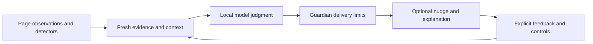

# Angel


**A browsing companion that offers perspective and leaves the choice with you.**

Angel is a Chrome Manifest V3 extension that observes page mechanics and browsing signals, consults an on-device model, and occasionally offers a dismissible nudge. It does not block websites, enforce time limits, or navigate for you.

[Website](https://shaw029.github.io/angel/) · [Published releases](https://github.com/shaw029/angel/releases) · [Changelog](CHANGELOG.md) · [Contributing](CONTRIBUTING.md)

## Release status

| Channel | Version | Meaning |
| --- | --- | --- |
| Latest published GitHub release | [v0.2.2](https://github.com/shaw029/angel/releases/tag/v0.2.2) | Published 18 September 2026; download this for the released build. |
| This source tree | **0.3.0-dev.1** | Unreleased companion improvements. Building this branch includes the features below. |

GitHub releases, the Chrome Web Store, and the development branch are separate delivery channels. A merged change or development build does not mean a store update has been published. See the [release process](docs/RELEASING.md).

## AI setup in development

Open the popup to see why Angel uses local AI, its download estimate, and an illustrative example. Choose **Download and enable Angel** or **Not now**. No model download begins without consent, including when upgrading from an older version that loaded automatically.

The initial text-model files total approximately **3.1 GB for GPU** or **3.6 GB for CPU**. Estimates come from a pinned file manifest, not measured RAM usage; setup needs additional resources. Download progress spans all files. Closing the popup keeps setup running while Chrome is open; **Cancel setup** stops it. Complete cached files may be reused. Automatic restarts only use cache; missing files or a changed model revision require an explicit setup choice.

AI remains required for proactive nudges. Controls and saved return points work while AI is off. For a simulated preview with no model download, run the screenshot harness and open `/?setup&companion`. See [AI onboarding](docs/AI_ONBOARDING.md) for limitations and validation.

## Companion improvements in development

- **Ask Angel:** a popup controls panel for optional intent, the last nudge explanation, quiet/resume, and a saved return point. It is not a freeform chatbot.
- **Your intent comes first:** optionally state what you are here for. Change or clear it whenever you want. **I chose this** corrects Angel and quiets the current tab/site episode.
- **Evidence you can inspect:** both nudge sizes offer **Why this?** and correction. Visible copy describes observed mechanics; it does not invent your feelings, a price prediction, or an autoplay chain.
- **Useful actions:** explicitly mark a nudge Helpful, save the current page for later, or request a five-minute reminder. Opening a saved page always requires your click.
- **Fewer stale interruptions:** navigation, visibility, evidence freshness, preference changes, and delivery limits are checked before a nudge appears. Repeated reasons are suppressed within an episode.

Intent and quiet mode belong to a tab on its current origin. They reset on an origin change or after 30 minutes without an observed foreground snapshot. A saved return point survives navigation until forgotten, the tab closes, or the browser session ends.

The model and heuristics can be wrong. An `aligned` or `unknown` model judgment stays quiet; explicit corrections are the only inputs to user-alignment priors. Behavioral state labels are estimates, not diagnoses or proof of intent.

## How it works


```mermaid
flowchart LR
  A[Page observations and detectors] --> B[Fresh evidence and context]
  B --> C[Local model judgment]
  C --> D[Guardian delivery limits]
  D --> E[Optional nudge and explanation]
  E --> F[Explicit feedback and controls]
  F --> B
```

The **Witness** collects evidence. The **Narrator** proposes whether and how prominently to speak. The **Guardian** can withhold or reduce that proposal and enforces a minimum 150-second gap and a maximum of five nudges per rolling hour, including requested reminders. See [architecture](docs/ARCHITECTURE.md) and the [cognitive model](docs/COGNITIVE_MODEL.md).

Inference uses `onnx-community/gemma-4-E2B-it-ONNX` through Transformers.js, with WebGPU and a WASM fallback. The model revision and download sizes are pinned in `src/shared/model-manifest.json`. A smaller Gemma 3 1B option was evaluated and not shipped; see the [offline evaluation record](docs/evaluation/LITE_VS_FULL.md). No hardware-independent speed or memory claims are made.

## Run locally

Use Node.js 22 or newer and npm. Chrome must support Manifest V3 and offscreen documents. Model loading needs network access and sufficient local storage/memory; browser and hardware support affect inference.

```sh
npm ci
npm run build
```

The build copies its WASM runtime automatically. Open `chrome://extensions`, enable **Developer mode**, choose **Load unpacked**, and select `dist/`. Reload the extension after rebuilding.

```sh
npm run dev                 # extension watch build
npm run check               # versions, TypeScript, regression tests
npm run package             # checked build + ZIP + SHA-256 checksum (requires zip)
npm run demo                # optional local demo at http://localhost:3001
```

For the website:

```sh
npm --prefix landing ci
npm --prefix landing run dev
npm --prefix landing run build
```

For UI fixtures, run `npx vite --config screenshots/harness/vite.config.ts`; `/?companion` previews the real popup with mock data. Fixtures are illustrations, not measured user outcomes.

## Data and privacy

Browsing observations and inference stay in the browser. Detectors scan visible text locally; matched text is not sent to the model. The model receives compact signal labels, page titles, session context, optional intent, and aggregates. Host-page form values are not read.

Local storage holds settings and aggregate history. Browser session storage also holds temporary companion context, explanations, reminder state, and any URL/title you explicitly save. This is not an aggregate-only storage design. See [storage boundaries](docs/ARCHITECTURE.md#storage-and-lifetime).

Model weights and tokenizer files are downloaded from Hugging Face and cached. Downloads may involve multiple requests and recur after cache eviction or upgrades. The extension has no telemetry. The separate website uses analytics and embeds a YouTube video; its [privacy page](https://shaw029.github.io/angel/privacy.html) describes those separately.

## Documentation

- [Architecture and lifecycle](docs/ARCHITECTURE.md)
- [Behavioral estimates and adaptation](docs/COGNITIVE_MODEL.md)
- [Metrics and validation limits](docs/EVALUATION.md)
- [Offline model evaluation](docs/evaluation/FULL.md) and the [Lite vs Full record](docs/evaluation/LITE_VS_FULL.md)
- [Companion implementation and test coverage](docs/COMPANION_IMPLEMENTATION.md)
- [Future work](docs/COMPANION_ROADMAP.md)
- [Release and version policy](docs/RELEASING.md)

Automated checks cover orchestration, evidence, corrections, reminder limits, and static UI rendering. `npm run eval:models` scores the real model offline on CPU against companion scenarios. In-browser model evaluation and interactive Chrome lifecycle validation remain necessary before a stable release. Local counters do not demonstrate improved wellbeing or causal benefit.

## License

[MIT](LICENSE). Model artifacts remain subject to their own upstream license and terms.
